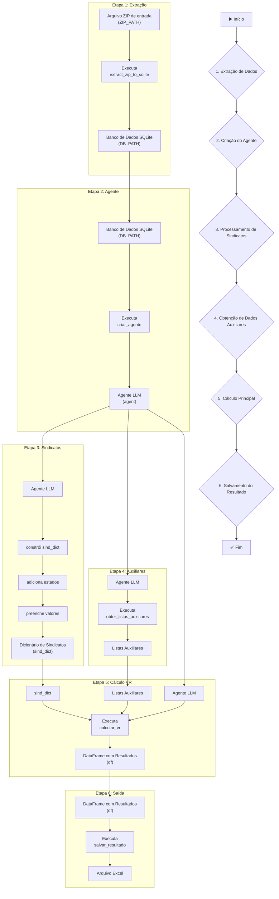

# Projeto VR Mensal

Este projeto processa planilhas contidas em um arquivo ZIP, carrega os dados em um banco SQLite, 
faz consultas usando um LLM (Google Gemini via LangChain) e gera uma planilha final com os valores de VR para cada funcionário.

# Como a solução foi construida
A aplicação foi estruturada em quatro etapas principais:

Carregamento dos dados (LOAD)
Os arquivos ZIP são extraídos e os dados contidos nas planilhas são carregados em um banco de dados SQLite. -> extractor.py.

Criação do agente de consultas
É criado um agente utilizando LangChain que permite consultar a base de dados SQLite de forma interativa, facilitando a extração de informações necessárias para o processamento. -> agent.py

Processamento dos dados
Com os dados carregados, o agente é utilizado para consultar a base. Em seguida, os dados são organizados, agregados e filtrados de acordo com as regras definidas no enunciado. -> processing.py

Geração da planilha final
Por fim, os dados processados são consolidados e exportados para um arquivo de saída, gerando a planilha VR MENSAL 05.2025 com os valores correspondentes a cada funcionário. -> processing.py 

## Estrutura de Pastas
````

├── data/
│ └── Desafio 4 - Dados.zip
├── src/
│ ├── config.py
│ ├── database.py
│ ├── extractor.py
│ ├── agent.py
│ ├── processing.py
│ └── main.py
├── requirements.txt
└── README.md
````

## Como Rodar

1. Crie e ative um ambiente virtual:

```` bash
python -m venv .venv

source .venv/bin/activate   # Linux/Mac

.venv\Scripts\activate      # Windows
````

2. Instale as dependências:

```` bash
pip install -r requirements.txt
````

3. Crie um arquivo .env na raiz do projeto com sua chave da API do Google:

```` 
GOOGLE_API_KEY=sua_chave_aqui
````

4. Execute o projeto:

````
python -m src.main
````

5. Diagrama do fluxo:


