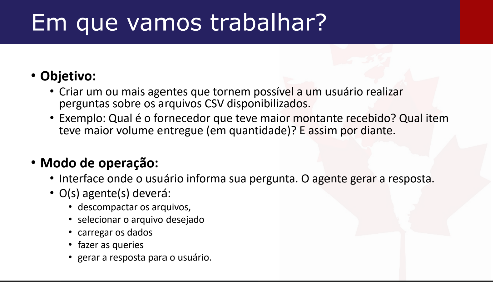

# agentes-inteligentes-I2A2
Repositório do grupo Agentes de Turing, sobre o curso de Agentes Inteligentes idealizado pela I2A2

## Descrição da tarefa


# Chat com Banco de Dados usando Gemini e LangChain

Este projeto permite que você converse com seus dados (de arquivos CSV e Excel) usando linguagem natural. Ele usa o modelo Gemini do Google para entender suas perguntas, buscar as informações no banco de dados e te dar uma resposta.

## Como Funciona

1.  **Carrega Dados:**
    *   Pega arquivos `.csv` e `.xlsx` de dentro de um arquivo `.zip`.
    *   Salva esses dados em um banco de dados SQLite local. Cada arquivo/planilha vira uma tabela.
2.  **Entende sua Pergunta:**
    *   Você faz uma pergunta como "Quantas vendas tivemos em janeiro?".
    *   O modelo Gemini (via LangChain) traduz sua pergunta para uma consulta SQL.
3.  **Busca e Responde:**
    *   A consulta SQL é executada no banco de dados.
    *   O resultado é usado para gerar uma resposta clara para você.

## Para Começar

1.  **Instale o necessário:**
    ```bash
    pip install pandas sqlalchemy langchain-google-genai langchain-experimental python-dotenv
    ```

2.  **Sua Chave Google Gemini:**
    *   Crie um arquivo chamado `.env` na pasta do projeto.
    *   Dentro dele, coloque: `GOOGLE_API_KEY="SUA_CHAVE_API_AQUI"`
    *   (Não envie este arquivo para o Git! Adicione `.env` ao seu `.gitignore`.)

3.  **Seus Dados:**
    *   Coloque seus arquivos `.csv` e `.xlsx` dentro de um arquivo ZIP (ex: `data/meus_dados.zip`).
    *   No script Python, ajuste `zip_path` para o caminho do seu ZIP.

4.  **Rode o Script:**
    ```bash
    python seu_script.py
    ```

## O Que o Script Faz

*   **`extract_zip_to_sqlite`:** Lê o ZIP e cria o banco de dados SQLite.
*   **`criar_agente`:** Prepara o "cérebro" (Gemini + LangChain) para conversar com o banco.
*   **`perguntar`:** Envia sua pergunta para o agente e recebe a resposta.
*   A parte final do script (`if __name__ == "__main__":`) executa tudo e faz algumas perguntas de exemplo.

## Importante

*   O script tenta criar um `dados.zip` de exemplo se não encontrar o seu, apenas para demonstração.
*   O modelo Gemini usado é o `"gemini-1.5-flash-preview-05-20"`. Você pode trocar por outros. [Modelos](https://ai.google.dev/gemini-api/docs/models)

## Ref

[Exemplo](https://colab.research.google.com/github/sudarshan-koirala/youtube-stuffs/blob/main/langchain/sql_chain.ipynb#scrollTo=ec47a2bf)
